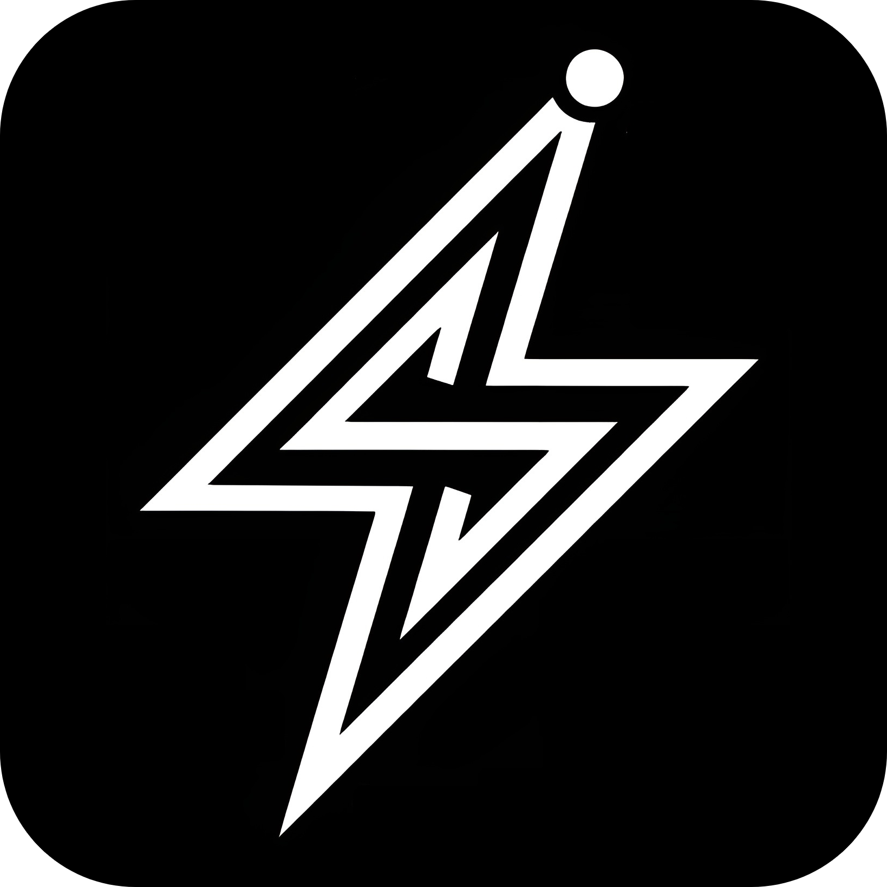
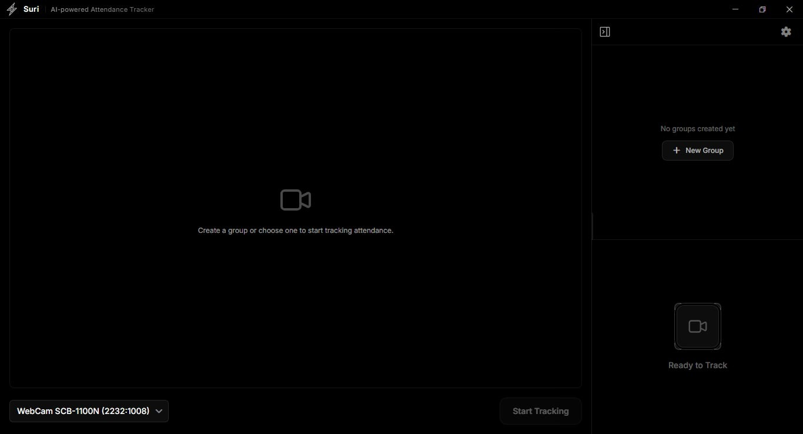

<!-- PROJECT SHIELDS -->

[![Contributors][contributors-shield]][contributors-url]
[![Forks][forks-shield]][forks-url]
[![Stargazers][stars-shield]][stars-url]
[![Issues][issues-shield]][issues-url]
[![AGPL License][license-shield]][license-url]

<!-- PROJECT LOGO -->
 

  

  <h1 style="font-size: 4rem; margin-bottom: 0; border-bottom: none;">Suri</h1>
  
[su-rì] • verb (Tagalog)

  

    To analyze; examine. 
  

  

      A Real-Time, Privacy-Centric AI Attendance System.
     
    <a href="docs/FEATURES.md"><strong>Explore the Features »</strong></a>
     
     
    <a href="docs/INSTALLATION.md">Installation Guide</a>
    &middot;
    <a href="https://github.com/johnraivenolazo/suri/issues/new?labels=bug&template=bug-report---.md">Report Bug</a>
    &middot;
    <a href="https://github.com/johnraivenolazo/suri/issues/new?labels=enhancement&template=feature-request---.md">Request Feature</a>
  

 

<!-- INTRO -->
**Suri** is an offline-first attendance solution designed for speed and data sovereignty. By executing the entire AI pipeline locally, Suri eliminates network latency and keeps biometric data strictly under local control.

No servers. No cloud. Just the hardware.

   
  
   

---

### Why Suri?

| **Local First** | **Privacy by Default** | **Remote Sync** |
|:---|:---|:---|
| AI runs 100% on local hardware. Recognition takes ~15ms because there's no server round-trip. | No biometric data leaves the device unless Sync is enabled. Everything is encrypted at rest. | Backup logs and view reports from any device. End-to-end encryption (E2EE) prevents biometric data from reaching the cloud. |

   
  <a href="docs/FEATURES.md">Explore Features →</a>
   

---

## Documentation

Dig into the specifics:

- [**Features & Capabilities**](docs/FEATURES.md) - How attendance groups, sessions, and exports work.
- [**Architecture & Stack**](docs/ARCHITECTURE.md) - The Electron + FastAPI + ONNX setup.
- [**Installation & Setup**](docs/INSTALLATION.md) - Get it running in minutes.
- [**Troubleshooting**](docs/TROUBLESHOOTING.md) - Quick fixes and diagnostic codes.
- [**Privacy & Security**](docs/PRIVACY.md) - How we handle biometric data and encryption.

(<a href="#readme-top">back to top</a>)

<!-- TECH STACK -->
## Tech Stack

  Suri uses a modern, high-performance stack to deliver a native experience.

    

(<a href="#readme-top">back to top</a>)

<!-- ROADMAP -->
## Roadmap

### Phase 1: Local Foundation (Completed)
- [x] **Core AI**: Local Face Recognition & Liveness Detection.
- [x] **Data Management**: CSV Import/Export & Group Management.
- [x] **Privacy Architecture**: Local-first SQLite & E2EE logic.

### Phase 2: Connectivity (In-Progress)
- [ ] **Multi-Camera**: Parallel RTSP stream support for large venues.
- [ ] **Remote Sync**: Background synchronization with the Cloud Bridge.

### Phase 3: Ecosystem (Future)
- [ ] **Remote Dashboard**: Centralized web-based admin panel for report aggregation.
- [ ] **Mobile Companion**: Attendance check-in and notification app.

Visit the [issues page](https://github.com/johnraivenolazo/suri/issues) to submit feature requests.

(<a href="#readme-top">back to top</a>)

<!-- CONTRIBUTING -->
## Contributing

Suri is open source because tools like this should be accessible to everyone. If you want to help make it better, pull requests are always welcome.

1. Fork the project
2. Create a branch (`git checkout -b feature/AmazingFeature`)
3. Commit what you've built (`git commit -m 'Add some AmazingFeature'`)
4. Push it to your fork (`git push origin feature/AmazingFeature`)
5. Open a Pull Request

(<a href="#readme-top">back to top</a>)

<!-- LICENSE -->
## License

Distributed under the **AGPL-3.0 License**. See `LICENSE` for more information.

This project relies on open source software. See [Third Party Licenses](THIRD_PARTY_LICENSES.md) for details.

(<a href="#readme-top">back to top</a>)

<!-- ACKNOWLEDGMENTS -->
## Acknowledgments

*   [FastAPI](https://fastapi.tiangolo.com/) - Powering the low-latency local API.
*   [ONNX Runtime](https://onnxruntime.ai/) - Enabling high-performance edge inference.
*   [Electron](https://www.electronjs.org/) - Providing the native desktop experience.
*   [React](https://react.dev/) - Modern UI state management.
*   [OpenCV](https://opencv.org/) - The backbone for real-time image processing.

(<a href="#readme-top">back to top</a>)

<!-- MARKDOWN LINKS & IMAGES -->
[contributors-shield]: https://img.shields.io/github/contributors/johnraivenolazo/suri.svg?style=for-the-badge&color=000000
[contributors-url]: https://github.com/johnraivenolazo/suri/graphs/contributors
[forks-shield]: https://img.shields.io/github/forks/johnraivenolazo/suri.svg?style=for-the-badge&color=000000
[forks-url]: https://github.com/johnraivenolazo/suri/network/members
[stars-shield]: https://img.shields.io/github/stars/johnraivenolazo/suri.svg?style=for-the-badge&color=000000
[stars-url]: https://github.com/johnraivenolazo/suri/stargazers
[issues-shield]: https://img.shields.io/github/issues/johnraivenolazo/suri.svg?style=for-the-badge&color=000000
[issues-url]: https://github.com/johnraivenolazo/suri/issues
[license-shield]: https://img.shields.io/github/license/johnraivenolazo/suri.svg?style=for-the-badge&color=000000
[license-url]: LICENSE

[Electron.js]: https://img.shields.io/badge/Electron-2B2E3A?style=for-the-badge&logo=electron&logoColor=9FEAF9
[Electron-url]: https://www.electronjs.org/
[React.js]: https://img.shields.io/badge/React-20232A?style=for-the-badge&logo=react&logoColor=61DAFB
[React-url]: https://reactjs.org/
[Python.org]: https://img.shields.io/badge/Python-3776AB?style=for-the-badge&logo=python&logoColor=white
[Python-url]: https://www.python.org/
[FastAPI]: https://img.shields.io/badge/FastAPI-009688?style=for-the-badge&logo=fastapi&logoColor=white
[FastAPI-url]: https://fastapi.tiangolo.com/
[ONNX]: https://img.shields.io/badge/ONNX-005CED?style=for-the-badge&logo=onnx&logoColor=white
[ONNX-url]: https://onnxruntime.ai/
[TailwindCSS]: https://img.shields.io/badge/Tailwind_CSS-38B2AC?style=for-the-badge&logo=tailwind-css&logoColor=white
[TailwindCSS-url]: https://tailwindcss.com/
[Vite]: https://img.shields.io/badge/Vite-646CFF?style=for-the-badge&logo=vite&logoColor=white
[Vite-url]: https://vitejs.dev/
[SQLite]: https://img.shields.io/badge/SQLite-07405E?style=for-the-badge&logo=sqlite&logoColor=white
[SQLite-url]: https://www.sqlite.org/
[SQLAlchemy]: https://img.shields.io/badge/SQLAlchemy-D71F00?style=for-the-badge&logo=sqlalchemy&logoColor=white
[SQLAlchemy-url]: https://www.sqlalchemy.org/
