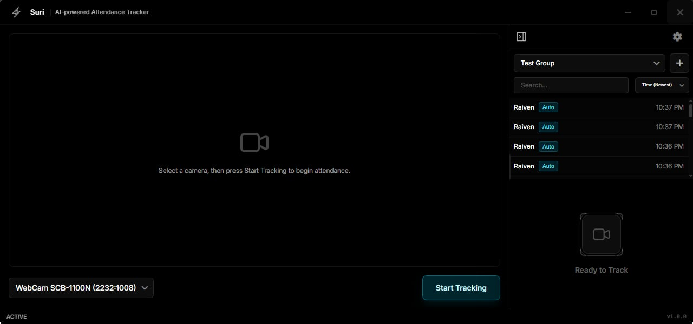

<!-- PROJECT SHIELDS -->

[![Contributors][contributors-shield]][contributors-url]
[![Forks][forks-shield]][forks-url]
[![Stargazers][stars-shield]][stars-url]
[![Issues][issues-shield]][issues-url]
[![AGPL License][license-shield]][license-url]

<!-- PROJECT LOGO -->
 

  

<h3 align="center">Suri</h3>

  

    The Enterprise-Grade, Local-First AI Attendance Platform.
     
    <a href="docs/FEATURES.md"><strong>Explore the Features »</strong></a>
     
     
    <a href="docs/INSTALLATION.md">Installation Guide</a>
    &middot;
    <a href="https://github.com/suriAI/suri/issues/new?labels=bug&template=bug-report---.md">Report Bug</a>
    &middot;
    <a href="https://github.com/suriAI/suri/issues/new?labels=enhancement&template=feature-request---.md">Request Feature</a>
  

  

 

<!-- INTRO -->
**Suri** is a desktop application for automated attendance tracking using facial recognition. Designed for secure environments, it runs the complete AI pipeline locally on the device to ensure speed and privacy.

Unlike cloud-based services, Suri executes all processing on the local hardware (CPU/GPU). This approach eliminates network latency and keeps data within the local infrastructure.

   
  
   

---

### Why Suri?

| **Local Performance** | **Data Privacy** | **Smart Tracking** |
|:---|:---|:---|
| Uses refined **ONNX Runtime** inference. Delivers **sub-millisecond recognition** by removing network dependency. Works offline. | **Local-First** architecture. Biometric data is stored only on the device's encrypted database. No external telemetry. | Uses **Re-ID Association** and **Passive Liveness** to track identities across video frames. Prevents spoofing with photo/video attacks. |

   
  <a href="docs/FEATURES.md">Explore Features →</a>
   

---

## Documentation

Detailed technical documentation is organized into dedicated guides.

- [**Features & Capabilities**](docs/FEATURES.md) - Details on Attendance Groups, Sessions, and Exports.
- [**Architecture & Stack**](docs/ARCHITECTURE.md) - Understand the Electron + FastAPI + ONNX hybrid design.
- [**Installation & Setup**](docs/INSTALLATION.md) - Step-by-step guide to get running in minutes.
- [**Troubleshooting**](docs/TROUBLESHOOTING.md) - Diagnostic codes and environment flags.
- [**Privacy & Security**](docs/PRIVACY.md) - Management of biometric embeddings and data encryption.

(<a href="#readme-top">back to top</a>)

<!-- TECH STACK -->
## Built With

Suri uses a modern, high-performance stack to deliver a native experience.

  

(<a href="#readme-top">back to top</a>)

<!-- ROADMAP -->
## Roadmap

- [x] **Core AI**: Local Face Recognition & Liveness Detection.
- [x] **Data Management**: CSV Import/Export & Group Management.
- [ ] **Multi-Camera**: Support for parallel RTSP streams.
- [ ] **Remote Dashboard**: Optional web-based admin panel.
- [ ] **Mobile Companion**: Check-in app for attendees.

Visit the [issues page](https://github.com/suriAI/suri/issues) to submit feature requests.

(<a href="#readme-top">back to top</a>)

<!-- CONTRIBUTING -->
## Contributing

Contributions are what make the open source community such an amazing place to learn, inspire, and create. Any contributions you make are **greatly appreciated**.

1. Fork the Project
2. Create your Feature Branch (`git checkout -b feature/AmazingFeature`)
3. Commit your Changes (`git commit -m 'Add some AmazingFeature'`)
4. Push to the Branch (`git push origin feature/AmazingFeature`)
5. Open a Pull Request

(<a href="#readme-top">back to top</a>)

<!-- LICENSE -->
## License

Distributed under the **AGPL-3.0 License**. See `LICENSE.txt` for more information.

This project relies on open source software. See [Third Party Licenses](docs/THIRD_PARTY_LICENSES.md) for details.

(<a href="#readme-top">back to top</a>)

<!-- ACKNOWLEDGMENTS -->
## Acknowledgments

* [FastAPI](https://fastapi.tiangolo.com/)
* [ONNX Runtime](https://onnxruntime.ai/)
* [Electron](https://www.electronjs.org/)
* [React](https://react.dev/)
* [OpenCV](https://opencv.org/)

(<a href="#readme-top">back to top</a>)

<!-- MARKDOWN LINKS & IMAGES -->
[contributors-shield]: https://img.shields.io/github/contributors/suriAI/suri.svg?style=for-the-badge&color=000000
[contributors-url]: https://github.com/suriAI/suri/graphs/contributors
[forks-shield]: https://img.shields.io/github/forks/suriAI/suri.svg?style=for-the-badge&color=000000
[forks-url]: https://github.com/suriAI/suri/network/members
[stars-shield]: https://img.shields.io/github/stars/suriAI/suri.svg?style=for-the-badge&color=000000
[stars-url]: https://github.com/suriAI/suri/stargazers
[issues-shield]: https://img.shields.io/github/issues/suriAI/suri.svg?style=for-the-badge&color=000000
[issues-url]: https://github.com/suriAI/suri/issues
[license-shield]: https://img.shields.io/github/license/suriAI/suri.svg?style=for-the-badge&color=000000
[license-url]: https://github.com/suriAI/suri/blob/master/LICENSE.txt

[Electron.js]: https://img.shields.io/badge/Electron-2B2E3A?style=for-the-badge&logo=electron&logoColor=9FEAF9
[Electron-url]: https://www.electronjs.org/
[React.js]: https://img.shields.io/badge/React-20232A?style=for-the-badge&logo=react&logoColor=61DAFB
[React-url]: https://reactjs.org/
[Python.org]: https://img.shields.io/badge/Python-3776AB?style=for-the-badge&logo=python&logoColor=white
[Python-url]: https://www.python.org/
[FastAPI]: https://img.shields.io/badge/FastAPI-009688?style=for-the-badge&logo=fastapi&logoColor=white
[FastAPI-url]: https://fastapi.tiangolo.com/
[ONNX]: https://img.shields.io/badge/ONNX-005CED?style=for-the-badge&logo=onnx&logoColor=white
[ONNX-url]: https://onnxruntime.ai/
[TailwindCSS]: https://img.shields.io/badge/Tailwind_CSS-38B2AC?style=for-the-badge&logo=tailwind-css&logoColor=white
[TailwindCSS-url]: https://tailwindcss.com/
[Vite]: https://img.shields.io/badge/Vite-646CFF?style=for-the-badge&logo=vite&logoColor=white
[Vite-url]: https://vitejs.dev/
[SQLite]: https://img.shields.io/badge/SQLite-07405E?style=for-the-badge&logo=sqlite&logoColor=white
[SQLite-url]: https://www.sqlite.org/
[SQLAlchemy]: https://img.shields.io/badge/SQLAlchemy-D71F00?style=for-the-badge&logo=sqlalchemy&logoColor=white
[SQLAlchemy-url]: https://www.sqlalchemy.org/
