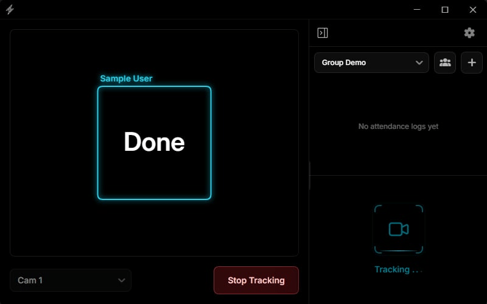

<!-- PROJECT SHIELDS -->

[![Contributors][contributors-shield]][contributors-url]
[![Forks][forks-shield]][forks-url]
[![Stargazers][stars-shield]][stars-url]
[![Issues][issues-shield]][issues-url]
[![AGPL License][license-shield]][license-url]

<!-- PROJECT LOGO -->
 

  

  <h1 style="font-size: 4rem; margin-bottom: 0; border-bottom: none;">Suri</h1>
  
AI ATTENDANCE TRACKER

  

    Offline-first. Privacy-centric. Local AI.
     
    <a href="docs/FEATURES.md"><strong>Explore Features »</strong></a>
     
     
    <a href="docs/INSTALLATION.md">Setup Guide</a>
    &middot;
    <a href="https://github.com/SuriAI/suri/issues/new?labels=bug&template=bug-report---.md">Report Bug</a>
    &middot;
    <a href="https://github.com/SuriAI/suri/issues/new?labels=enhancement&template=feature-request---.md">Request Feature</a>
  

 

<!-- INTRO -->
**Suri** is an offline attendance tool. It executes the entire AI pipeline locally to eliminate network latency and keep biometric data on-device.

   
  
   

---

### Why Suri?

| **Local First** | **Privacy by Default** | **Encrypted Vaults** |
|:---|:---|:---|
| AI runs on local hardware. No server round-trips. | Face images are never saved. Faces are converted to mathematical embeddings. | AES-256-GCM encrypted `.suri` vaults. Password required for restoration. |

   
  <a href="docs/FEATURES.md">Explore Features</a>
   

---
## Download

---
## Documentation

Dig into the specifics:

- [**Features & Capabilities**](docs/FEATURES.md) - How attendance groups, sessions, and exports work.
- [**Architecture & Stack**](docs/ARCHITECTURE.md) - The Electron + FastAPI + ONNX setup.
- [**Installation & Setup**](docs/INSTALLATION.md) - Get it running in minutes.
- [**Troubleshooting**](docs/TROUBLESHOOTING.md) - Quick fixes and diagnostic codes.
- [**Privacy & Security**](docs/PRIVACY.md) - How we handle biometric data and encryption.

(<a href="#readme-top">back to top</a>)

<!-- TECH STACK -->
## Tech Stack

  Suri is built with a focused stack for low-latency desktop performance.

    

(<a href="#readme-top">back to top</a>)

<!-- ROADMAP -->
## Roadmap

### Phase 1: Local Foundation (Completed)
- [x] **Core AI**: Local Face Recognition & Liveness Detection.
- [x] **Data Integrity**: Atomic System Backups & Encrypted Vaults (.suri).
- [x] **Privacy Architecture**: Local-first SQLite & Zero-Knowledge logic.

### Phase 2: Connectivity (In-Progress)
- [ ] **Multi-Camera**: Parallel RTSP stream support for large venues.
- [ ] **Secure Sync**: Automated encrypted backup synchronization with Cloud Bridge.

### Phase 3: Ecosystem (Future)
- [ ] **Zero-Knowledge Dashboard**: Centralized admin panel for report aggregation without biometric exposure.
- [ ] **Mobile Companion**: Remote attendance check-in and automated notifications.

Visit the [issues page](https://github.com/johnraivenolazo/suri/issues) to submit feature requests.

(<a href="#readme-top">back to top</a>)

<!-- CONTRIBUTING -->
## Contributing

Suri is open source. If you want to help make it better, pull requests are welcome.

1. Fork the project
2. Create a branch (`git checkout -b feature/AmazingFeature`)
3. Commit what you've built (`git commit -m 'Add some AmazingFeature'`)
4. Push it to your fork (`git push origin feature/AmazingFeature`)
5. Open a Pull Request

(<a href="#readme-top">back to top</a>)

<!-- LICENSE -->
## License

Distributed under the **AGPL-3.0 License**. See `LICENSE` for more information.

This project relies on open source software. See [Third Party Licenses](THIRD_PARTY_LICENSES.md) for details.

(<a href="#readme-top">back to top</a>)

<!-- ACKNOWLEDGMENTS -->
## Acknowledgments

*   [FastAPI](https://fastapi.tiangolo.com/) - High-performance local API framework.
*   [ONNX Runtime](https://onnxruntime.ai/) - Local edge inference engine.
*   [Electron](https://www.electronjs.org/) - Native desktop runtime.
*   [React](https://react.dev/) - Modern UI state management.
*   [OpenCV](https://opencv.org/) - The backbone for real-time image processing.

(<a href="#readme-top">back to top</a>)

<!-- MARKDOWN LINKS & IMAGES -->
[contributors-shield]: https://img.shields.io/github/contributors/SuriAI/suri.svg?style=for-the-badge&color=000000
[contributors-url]: https://github.com/SuriAI/suri/graphs/contributors
[forks-shield]: https://img.shields.io/github/forks/SuriAI/suri.svg?style=for-the-badge&color=000000
[forks-url]: https://github.com/SuriAI/suri/network/members
[stars-shield]: https://img.shields.io/github/stars/SuriAI/suri.svg?style=for-the-badge&color=000000
[stars-url]: https://github.com/SuriAI/suri/stargazers
[issues-shield]: https://img.shields.io/github/issues/SuriAI/suri.svg?style=for-the-badge&color=000000
[issues-url]: https://github.com/SuriAI/suri/issues
[license-shield]: https://img.shields.io/github/license/SuriAI/suri.svg?style=for-the-badge&color=000000
[license-url]: LICENSE

[Electron.js]: https://img.shields.io/badge/Electron-2B2E3A?style=for-the-badge&logo=electron&logoColor=9FEAF9
[Electron-url]: https://www.electronjs.org/
[React.js]: https://img.shields.io/badge/React-20232A?style=for-the-badge&logo=react&logoColor=61DAFB
[React-url]: https://reactjs.org/
[Python.org]: https://img.shields.io/badge/Python-3776AB?style=for-the-badge&logo=python&logoColor=white
[Python-url]: https://www.python.org/
[FastAPI]: https://img.shields.io/badge/FastAPI-009688?style=for-the-badge&logo=fastapi&logoColor=white
[FastAPI-url]: https://fastapi.tiangolo.com/
[ONNX]: https://img.shields.io/badge/ONNX-005CED?style=for-the-badge&logo=onnx&logoColor=white
[ONNX-url]: https://onnxruntime.ai/
[TailwindCSS]: https://img.shields.io/badge/Tailwind_CSS-38B2AC?style=for-the-badge&logo=tailwind-css&logoColor=white
[TailwindCSS-url]: https://tailwindcss.com/
[Vite]: https://img.shields.io/badge/Vite-646CFF?style=for-the-badge&logo=vite&logoColor=white
[Vite-url]: https://vitejs.dev/
[SQLite]: https://img.shields.io/badge/SQLite-07405E?style=for-the-badge&logo=sqlite&logoColor=white
[SQLite-url]: https://www.sqlite.org/
[SQLAlchemy]: https://img.shields.io/badge/SQLAlchemy-D71F00?style=for-the-badge&logo=sqlalchemy&logoColor=white
[SQLAlchemy-url]: https://www.sqlalchemy.org/
